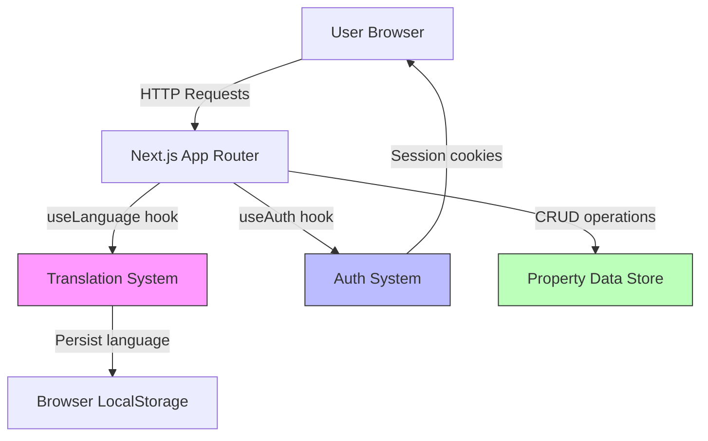
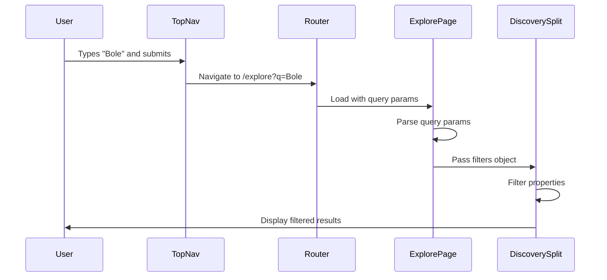
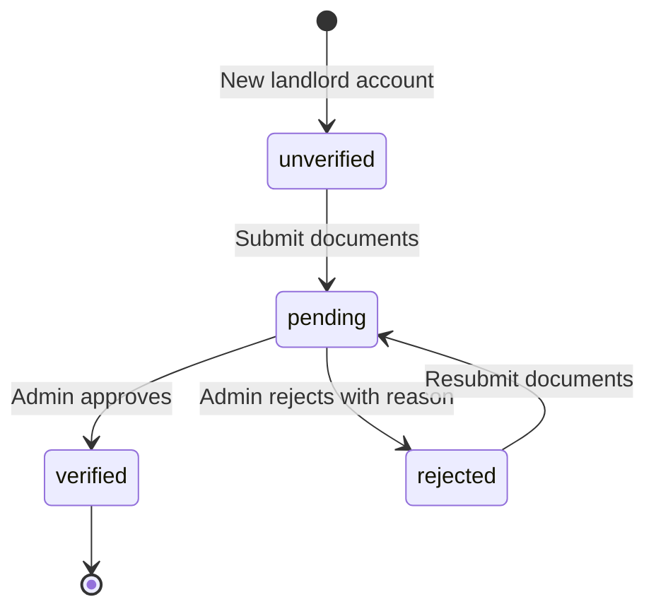

# Design Document: HomeLink Feature Completion

## Overview

This design addresses the completion of all partially implemented features in the HomeLink Ethiopia application. The application is a Next.js-based property rental platform with existing infrastructure for translation, authentication, and property management. This design focuses on connecting UI components to existing systems, implementing search and filtering functionality, creating missing dashboard pages, and establishing the landlord verification workflow.

### Design Goals

1. **Translation Integration**: Connect all pages to the existing Translation_System using the `useLanguage` hook pattern
2. **Search Implementation**: Enable property search through URL query parameters and client-side filtering
3. **Navigation Completion**: Ensure all navigation links resolve to functional pages
4. **Dashboard Pages**: Create all missing tenant, landlord, and admin dashboard pages following existing patterns
5. **Verification Workflow**: Implement landlord verification status tracking and admin approval interface
6. **Property CRUD**: Enable verified landlords to create, edit, and manage property listings
7. **Advanced Filtering**: Implement multi-criteria filtering on the explore page

### Key Constraints

- **Frontend-Only**: All functionality is client-side; no backend API changes
- **In-Memory Storage**: Property and user data stored in lib files (not persistent across page reloads in production)
- **Existing Patterns**: Must follow established component, styling, and routing conventions
- **No Breaking Changes**: Existing functionality must remain intact

## Architecture

### System Context



### Application Layers

The application follows a three-layer architecture:

1. **Presentation Layer** (Components)
   - Public pages: TopNav navigation, hero sections, property cards
   - Dashboard pages: Sidebar navigation, TopBar, role-specific content
   - Reusable components: Property_Card, filters, forms

2. **Business Logic Layer** (Lib files)
   - `lib/language-context.tsx`: Translation provider with localStorage persistence
   - `lib/auth-context.tsx`: Authentication with cookie-based sessions
   - `lib/properties.ts`: Property data with neighborhood-based coordinates
   - `lib/landlord.ts`: Landlord-specific property portfolio data
   - `lib/tenant*.ts`: Tenant-specific data (applications, payments, messages, maintenance)
   - `lib/admin*.ts`: Admin-specific data (disputes, fraud reports, market insights)

3. **Data Layer** (In-memory storage)
   - Hardcoded property data in `lib/properties.ts`
   - User data in `lib/auth-db.ts`
   - No persistent database; data resets on server restart

### Routing Structure

```
/                           # Homepage (public layout)
/explore                    # Property search and filtering (public layout)
/property/[id]              # Property detail page (public layout)
/login                      # Login page (public layout)
/signup                     # Signup page (public layout)
/logout                     # Logout handler (redirects)

/tenant/*                   # Tenant dashboard (tenant layout with Sidebar + TopBar)
  /dashboard                # Tenant overview
  /applications             # Rental applications
  /payments                 # Payment history
  /messages                 # Tenant-landlord messaging
  /maintenance              # Maintenance requests

/landlord/*                 # Landlord dashboard (landlord layout with Sidebar + TopBar)
  /dashboard                # Landlord overview (✓ exists)
  /properties               # Property management list
  /properties/new           # Create new property form
  /tenants                  # Tenant management
  /applications             # Rental applications (✓ exists)
  /rent-payments            # Rent tracking
  /maintenance              # Maintenance requests
  /verification-status      # Verification workflow

/admin/*                    # Admin dashboard (admin layout with Sidebar + TopBar)
  /dashboard                # Admin overview (✓ exists)
  /verification-queue       # Landlord verification approval
  /disputes                 # Dispute resolution (✓ exists)
  /fraud-reports            # Fraud report management (✓ exists)
  /market-insights          # Market analytics (✓ exists)
```

## Components and Interfaces

### Translation System Integration

**Existing Infrastructure:**
- `lib/language-context.tsx` provides `LanguageProvider` and `useLanguage` hook
- Translation files: `locales/en.json` and `locales/am.json`
- Current locale persisted to `localStorage` under key `homelink-language`

**Integration Pattern:**

```typescript
'use client'

import { useLanguage } from '@/lib/language-context'

export default function MyPage() {
  const { locale, setLocale, t } = useLanguage()
  
  return (
    <div>
      <h1>{t.mySection.title}</h1>
      <p>{t.mySection.description}</p>
      <button onClick={() => setLocale(locale === 'EN' ? 'AM' : 'EN')}>
        Switch to {locale === 'EN' ? 'Amharic' : 'English'}
      </button>
    </div>
  )
}
```

**Translation File Extension:**

New pages require new translation keys. The structure follows nested objects:

```json
{
  "common": { /* shared UI elements */ },
  "hero": { /* homepage hero section */ },
  "dashboard": {
    "tenant": { /* tenant dashboard strings */ },
    "landlord": { /* landlord dashboard strings */ },
    "admin": { /* admin dashboard strings */ }
  },
  "property": { /* property detail page */ },
  "search": { /* search and filters */ },
  "verification": { /* verification workflow */ }
}
```

### Search and Filter Architecture

**URL-Based Search Pattern:**

Search functionality uses URL query parameters to maintain state and enable sharing:

```
/explore?q=bole&neighborhood=Bole&type=apartment&minPrice=10000&maxPrice=25000&beds=2
```

**Search Component Flow:**



**Filter Interface:**

```typescript
interface SearchFilters {
  query?: string              // Free text search (title, location, description)
  neighborhood?: Neighborhood // Bole, Kazanchis, CMC, Saris, Yeka
  propertyType?: PropertyType // Apartment, House, Studio, Villa
  minPrice?: number
  maxPrice?: number
  beds?: number               // 1, 2, 3, 4+
}

function filterProperties(
  properties: Property[], 
  filters: SearchFilters
): Property[] {
  return properties.filter(property => {
    // Query: case-insensitive match in title, neighborhood, or future description field
    if (filters.query) {
      const q = filters.query.toLowerCase()
      const matches = 
        property.title.toLowerCase().includes(q) ||
        property.neighborhood.toLowerCase().includes(q)
      if (!matches) return false
    }
    
    // Neighborhood: exact match
    if (filters.neighborhood && property.neighborhood !== filters.neighborhood) {
      return false
    }
    
    // Price range
    if (filters.minPrice && property.priceEtb < filters.minPrice) {
      return false
    }
    if (filters.maxPrice && property.priceEtb > filters.maxPrice) {
      return false
    }
    
    // Bedrooms: exact match
    if (filters.beds && property.beds !== filters.beds) {
      return false
    }
    
    return true
  })
}
```

**TopNav Search Integration:**

```typescript
// In TopNav component
const router = useRouter()
const [searchInput, setSearchInput] = useState('')

function handleSearch(e: FormEvent) {
  e.preventDefault()
  if (searchInput.trim()) {
    router.push(`/explore?q=${encodeURIComponent(searchInput.trim())}`)
  }
}

return (
  <form onSubmit={handleSearch}>
    <input 
      value={searchInput}
      onChange={(e) => setSearchInput(e.target.value)}
      placeholder={t.hero.searchPlaceholder}
    />
  </form>
)
```

### Property Detail Page Navigation

**Property Card Click Handler:**

```typescript
import Link from 'next/link'

export function Property_Card({ property }: { property: Property }) {
  const { t } = useLanguage()
  
  return (
    <Link href={`/property/${property.id}`}>
      <div className="cursor-pointer hover:shadow-lg transition-shadow">
        <Image src={property.image} alt={property.title} />
        <h3>{property.title}</h3>
        <p>{property.neighborhood}</p>
        <p className="font-bold">{formatEtb(property.priceEtb)} / {t.properties.month}</p>
      </div>
    </Link>
  )
}
```

**Property Detail Page Structure:**

```typescript
// app/(public)/property/[id]/page.tsx
'use client'

import { useParams } from 'next/navigation'
import { PROPERTIES } from '@/lib/properties'
import { useLanguage } from '@/lib/language-context'
import TopNav from '@/components/TopNav'

export default function PropertyDetailPage() {
  const params = useParams()
  const { t } = useLanguage()
  const property = PROPERTIES.find(p => p.id === params.id)
  
  if (!property) {
    return (
      <>
        <TopNav />
        <main className="container mx-auto px-4 py-12">
          <h1>{t.property.notFound || "Property not found"}</h1>
          <Link href="/explore">{t.common.back}</Link>
        </main>
      </>
    )
  }
  
  return (
    <>
      <TopNav />
      <main className="container mx-auto px-4 py-8">
        {/* Image gallery */}
        {/* Property details */}
        {/* Contact landlord button */}
      </main>
    </>
  )
}
```

### Dashboard Page Pattern

All dashboard pages follow a consistent structure:

**Layout Structure:**

```tsx
// app/[role]/layout.tsx (tenant, landlord, or admin)
import Sidebar from '@/components/[role]/Sidebar'
import { AuthProvider } from '@/lib/auth-context'
import { LanguageProvider } from '@/lib/language-context'

export default function DashboardLayout({ children }: { children: React.ReactNode }) {
  return (
    <AuthProvider>
      <LanguageProvider>
        <div className="flex h-screen overflow-hidden bg-cream">
          <Sidebar />
          <div className="flex flex-1 flex-col overflow-y-auto">
            {children}
          </div>
        </div>
      </LanguageProvider>
    </AuthProvider>
  )
}
```

**Page Structure:**

```tsx
// app/[role]/[page]/page.tsx
'use client'

import TopBar from '@/components/[role]/TopBar'
import { useLanguage } from '@/lib/language-context'
import { useAuth } from '@/lib/auth-context'

export default function DashboardPage() {
  const { t } = useLanguage()
  const { user } = useAuth()
  
  return (
    <>
      <TopBar 
        title={t.dashboard.[role].[page].title}
        subtitle={t.dashboard.[role].[page].subtitle}
      />
      <main className="flex-1 space-y-8 px-6 py-8 sm:px-8">
        {/* Page content */}
      </main>
    </>
  )
}
```

### Landlord Verification Workflow

**Verification Status State Machine:**



**Verification Status Interface:**

```typescript
// In lib/auth-context.tsx
export type VerificationStatus = 'unverified' | 'pending' | 'verified' | 'rejected'

export interface User {
  id: string
  name: string
  email: string
  role: Role
  verificationStatus: VerificationStatus
  rejectionReason?: string      // Present only when status is 'rejected'
}

// In lib/auth-db.ts - extend User type
interface DbUser {
  // ... existing fields
  verificationDocuments?: {
    identityDocument?: string   // Base64 or file path
    propertyDocument?: string   // Base64 or file path
    submittedAt?: Date
  }
}
```

**Verification Status Page:**

```tsx
// app/landlord/verification-status/page.tsx
'use client'

import { useState } from 'react'
import TopBar from '@/components/landlord/TopBar'
import { useAuth } from '@/lib/auth-context'
import { useLanguage } from '@/lib/language-context'

export default function VerificationStatusPage() {
  const { user } = useAuth()
  const { t } = useLanguage()
  const [uploading, setUploading] = useState(false)
  
  function handleDocumentUpload(files: FileList) {
    // Convert to base64 or store file reference
    // Update user.verificationStatus to 'pending'
    // In real implementation, would send to backend
  }
  
  return (
    <>
      <TopBar 
        title={t.verification.title}
        subtitle={t.verification.subtitle}
      />
      <main className="px-8 py-8">
        {user?.verificationStatus === 'unverified' && (
          <div>
            <h2>{t.verification.uploadPrompt}</h2>
            <input type="file" multiple onChange={(e) => e.target.files && handleDocumentUpload(e.target.files)} />
          </div>
        )}
        
        {user?.verificationStatus === 'pending' && (
          <div className="bg-yellow-50 border border-yellow-200 p-6">
            <p>{t.verification.pendingMessage}</p>
          </div>
        )}
        
        {user?.verificationStatus === 'rejected' && (
          <div className="bg-red-50 border border-red-200 p-6">
            <p>{t.verification.rejectedMessage}</p>
            <p className="font-semibold">{user.rejectionReason}</p>
            <button onClick={() => {/* Resubmit flow */}}>
              {t.verification.resubmit}
            </button>
          </div>
        )}
        
        {user?.verificationStatus === 'verified' && (
          <div className="bg-green-50 border border-green-200 p-6">
            <p>{t.verification.verifiedMessage}</p>
          </div>
        )}
      </main>
    </>
  )
}
```

**Unverified Landlord Guard:**

```tsx
// app/landlord/properties/new/page.tsx
'use client'

import { useEffect } from 'react'
import { useRouter } from 'next/navigation'
import { useAuth } from '@/lib/auth-context'

export default function NewPropertyPage() {
  const { user } = useAuth()
  const router = useRouter()
  
  useEffect(() => {
    if (user?.verificationStatus !== 'verified') {
      router.push('/landlord/verification-status?message=verification_required')
    }
  }, [user, router])
  
  if (user?.verificationStatus !== 'verified') {
    return null // Will redirect
  }
  
  return (
    <>{/* Property creation form */}</>
  )
}
```

**Admin Verification Queue:**

```tsx
// app/admin/verification-queue/page.tsx
'use client'

import { useState } from 'react'
import TopBar from '@/components/admin/TopBar'
import { useLanguage } from '@/lib/language-context'
import { getAllPendingVerifications, approveVerification, rejectVerification } from '@/lib/admin'

export default function VerificationQueuePage() {
  const { t } = useLanguage()
  const [pendingVerifications, setPendingVerifications] = useState(getAllPendingVerifications())
  const [rejectionReason, setRejectionReason] = useState('')
  const [selectedUserId, setSelectedUserId] = useState<string | null>(null)
  
  function handleApprove(userId: string) {
    approveVerification(userId)
    setPendingVerifications(prev => prev.filter(v => v.userId !== userId))
  }
  
  function handleReject(userId: string, reason: string) {
    rejectVerification(userId, reason)
    setPendingVerifications(prev => prev.filter(v => v.userId !== userId))
    setSelectedUserId(null)
    setRejectionReason('')
  }
  
  return (
    <>
      <TopBar 
        title={t.admin.verificationQueue.title}
        subtitle={t.admin.verificationQueue.subtitle}
      />
      <main className="px-8 py-8">
        <div className="space-y-4">
          {pendingVerifications.map(verification => (
            <div key={verification.userId} className="border rounded-lg p-6">
              <h3>{verification.landlordName}</h3>
              <p>{verification.email}</p>
              <p>Submitted: {verification.submittedAt}</p>
              
              {/* Document viewer */}
              <div className="flex gap-2 mt-4">
                <button 
                  onClick={() => handleApprove(verification.userId)}
                  className="bg-verified text-white px-4 py-2 rounded"
                >
                  {t.admin.verificationQueue.approve}
                </button>
                <button 
                  onClick={() => setSelectedUserId(verification.userId)}
                  className="bg-rust text-white px-4 py-2 rounded"
                >
                  {t.admin.verificationQueue.reject}
                </button>
              </div>
              
              {selectedUserId === verification.userId && (
                <div className="mt-4">
                  <input 
                    type="text"
                    placeholder={t.admin.verificationQueue.rejectionReasonPlaceholder}
                    value={rejectionReason}
                    onChange={(e) => setRejectionReason(e.target.value)}
                    className="border rounded px-3 py-2 w-full"
                  />
                  <button 
                    onClick={() => handleReject(verification.userId, rejectionReason)}
                    className="mt-2 bg-rust text-white px-4 py-2 rounded"
                  >
                    {t.common.confirm}
                  </button>
                </div>
              )}
            </div>
          ))}
        </div>
      </main>
    </>
  )
}
```

### Property CRUD Operations

**Create Property Interface:**

```typescript
interface PropertyFormData {
  title: string
  neighborhood: Neighborhood
  priceEtb: number
  beds: number
  baths: number
  sizeSqm: number
  description: string
  images: File[]
  propertyType: 'apartment' | 'house' | 'studio' | 'villa'
  amenities: string[]
}

function validatePropertyForm(data: PropertyFormData): string[] {
  const errors: string[] = []
  
  if (!data.title || data.title.trim().length < 5) {
    errors.push('Title must be at least 5 characters')
  }
  if (!data.neighborhood) {
    errors.push('Neighborhood is required')
  }
  if (!data.priceEtb || data.priceEtb <= 0) {
    errors.push('Price must be greater than 0')
  }
  if (!data.beds || data.beds < 1) {
    errors.push('Number of bedrooms is required')
  }
  if (!data.baths || data.baths < 1) {
    errors.push('Number of bathrooms is required')
  }
  if (!data.description || data.description.trim().length < 20) {
    errors.push('Description must be at least 20 characters')
  }
  
  return errors
}
```

**Property Management Page:**

```tsx
// app/landlord/properties/page.tsx
'use client'

import Link from 'next/link'
import TopBar from '@/components/landlord/TopBar'
import { useLanguage } from '@/lib/language-context'
import { useAuth } from '@/lib/auth-context'
import { LANDLORD_PROPERTIES } from '@/lib/landlord'

export default function PropertiesPage() {
  const { t } = useLanguage()
  const { user } = useAuth()
  
  // Filter properties by current logged-in landlord
  // In reality would query by landlordId, here we show all from LANDLORD_PROPERTIES
  
  function handleStatusChange(propertyId: string, newStatus: 'active' | 'inactive') {
    // Update property status in lib/properties.ts or landlord.ts
    // This would modify the in-memory store
  }
  
  return (
    <>
      <TopBar 
        title={t.dashboard.landlord.properties.title}
        subtitle={t.dashboard.landlord.properties.subtitle}
      />
      <main className="px-8 py-8">
        <div className="flex justify-between items-center mb-6">
          <h2>{t.dashboard.landlord.properties.myProperties}</h2>
          <Link 
            href="/landlord/properties/new"
            className="bg-rust text-white px-4 py-2 rounded-lg"
          >
            {t.dashboard.landlord.properties.addNew}
          </Link>
        </div>
        
        <div className="grid gap-4">
          {LANDLORD_PROPERTIES.map(property => (
            <div key={property.id} className="border rounded-lg p-6 flex justify-between items-center">
              <div>
                <h3 className="font-semibold">{property.title}</h3>
                <p className="text-sm text-charcoal/60">{property.neighborhood}</p>
                <p className="font-bold">ETB {property.rentEtb.toLocaleString()}/month</p>
              </div>
              <div className="flex gap-2">
                <Link 
                  href={`/landlord/properties/${property.id}/edit`}
                  className="px-3 py-1 border rounded hover:bg-sand"
                >
                  {t.common.edit}
                </Link>
                <button
                  onClick={() => handleStatusChange(property.id, 'inactive')}
                  className="px-3 py-1 border rounded hover:bg-sand"
                >
                  {property.status === 'occupied' ? t.dashboard.landlord.properties.deactivate : t.dashboard.landlord.properties.activate}
                </button>
              </div>
            </div>
          ))}
        </div>
      </main>
    </>
  )
}
```

## Data Models

### Extended Property Model

```typescript
// Extend lib/properties.ts Property interface
export interface Property {
  id: string
  title: string
  neighborhood: Neighborhood
  priceEtb: number
  beds: number
  baths: number
  sizeSqm: number
  rating: number
  reviewCount: number
  verified: boolean
  image: string
  lat: number
  lng: number
  
  // NEW FIELDS for full property details
  description?: string
  propertyType?: 'apartment' | 'house' | 'studio' | 'villa'
  amenities?: string[]
  images?: string[]             // Additional interior photos
  landlordId?: string
  status?: 'active' | 'inactive' // For filtering from search results
  createdAt?: Date
  updatedAt?: Date
}
```

### User Model Extensions

```typescript
// In lib/auth-db.ts
interface User {
  id: string
  email: string
  passwordHash: string
  fullName: string
  phoneNumber: string
  role: 'tenant' | 'landlord' | 'admin'
  
  // NEW FIELDS for verification workflow
  verificationStatus: 'unverified' | 'pending' | 'verified' | 'rejected'
  verificationDocuments?: {
    identityDocument?: string
    propertyDocument?: string
    submittedAt?: Date
  }
  rejectionReason?: string
  verifiedAt?: Date
  verifiedBy?: string // Admin user ID
}
```

### Search State Model

```typescript
interface SearchState {
  query: string
  filters: {
    neighborhood?: Neighborhood
    propertyType?: 'apartment' | 'house' | 'studio' | 'villa'
    minPrice?: number
    maxPrice?: number
    beds?: number
  }
  results: Property[]
  resultsCount: number
}
```

## Error Handling

### Client-Side Error Boundaries

**Property Not Found:**
```tsx
// In /property/[id]/page.tsx
if (!property) {
  return (
    <>
      <TopNav />
      <main className="container mx-auto px-4 py-12 text-center">
        <h1 className="text-2xl font-bold mb-4">{t.property.notFound}</h1>
        <p className="text-charcoal/60 mb-6">{t.property.notFoundDescription}</p>
        <Link href="/explore" className="bg-rust text-white px-6 py-3 rounded-lg">
          {t.property.backToExplore}
        </Link>
      </main>
    </>
  )
}
```

**Authentication Guard:**
```tsx
// In dashboard layouts
'use client'

import { useEffect } from 'react'
import { useRouter } from 'next/navigation'
import { useAuth } from '@/lib/auth-context'

export default function DashboardLayout({ children }: { children: React.ReactNode }) {
  const { user, loading } = useAuth()
  const router = useRouter()
  
  useEffect(() => {
    if (!loading && !user) {
      router.push('/login?redirect=' + encodeURIComponent(window.location.pathname))
    }
  }, [user, loading, router])
  
  if (loading) {
    return <div className="flex items-center justify-center h-screen">Loading...</div>
  }
  
  if (!user) {
    return null // Will redirect
  }
  
  return (
    <>{/* Normal layout */}</>
  )
}
```

**Form Validation Errors:**
```tsx
// In property creation form
const [errors, setErrors] = useState<string[]>([])

function handleSubmit(e: FormEvent) {
  e.preventDefault()
  const validationErrors = validatePropertyForm(formData)
  
  if (validationErrors.length > 0) {
    setErrors(validationErrors)
    return
  }
  
  // Proceed with submission
}

return (
  <form onSubmit={handleSubmit}>
    {errors.length > 0 && (
      <div className="bg-red-50 border border-red-200 rounded p-4 mb-4">
        <ul className="list-disc list-inside">
          {errors.map((error, i) => (
            <li key={i} className="text-red-700">{error}</li>
          ))}
        </ul>
      </div>
    )}
    {/* Form fields */}
  </form>
)
```

**Empty States:**
```tsx
// In search results
{filteredProperties.length === 0 && (
  <div className="text-center py-12">
    <svg className="mx-auto h-12 w-12 text-charcoal/20" /* empty state icon */ />
    <h3 className="mt-4 text-lg font-semibold">{t.search.noResults}</h3>
    <p className="mt-2 text-charcoal/60">{t.search.noResultsDescription}</p>
    <button 
      onClick={() => clearFilters()}
      className="mt-4 text-rust hover:text-rust-dark"
    >
      {t.search.clearFilters}
    </button>
  </div>
)}
```

## Testing Strategy

This feature is **not suitable for property-based testing** as it primarily involves:
- UI rendering and layout
- State management and routing
- Integration between existing components
- Configuration and wiring of translation/auth systems

### Unit Testing Approach

**Filter Logic Tests:**
```typescript
// tests/filterProperties.test.ts
import { filterProperties } from '@/lib/search'
import { PROPERTIES } from '@/lib/properties'

describe('filterProperties', () => {
  it('filters by search query in title', () => {
    const results = filterProperties(PROPERTIES, { query: 'apartment' })
    expect(results.every(p => p.title.toLowerCase().includes('apartment'))).toBe(true)
  })
  
  it('filters by neighborhood', () => {
    const results = filterProperties(PROPERTIES, { neighborhood: 'Bole' })
    expect(results.every(p => p.neighborhood === 'Bole')).toBe(true)
  })
  
  it('filters by price range', () => {
    const results = filterProperties(PROPERTIES, { minPrice: 15000, maxPrice: 20000 })
    expect(results.every(p => p.priceEtb >= 15000 && p.priceEtb <= 20000)).toBe(true)
  })
  
  it('applies multiple filters with AND logic', () => {
    const results = filterProperties(PROPERTIES, { 
      neighborhood: 'Bole',
      beds: 2,
      minPrice: 15000
    })
    expect(results.every(p => 
      p.neighborhood === 'Bole' && 
      p.beds === 2 && 
      p.priceEtb >= 15000
    )).toBe(true)
  })
  
  it('returns empty array when no matches', () => {
    const results = filterProperties(PROPERTIES, { 
      neighborhood: 'Bole',
      minPrice: 100000 // Unrealistic price
    })
    expect(results).toEqual([])
  })
})
```

**Validation Tests:**
```typescript
// tests/propertyValidation.test.ts
import { validatePropertyForm } from '@/lib/propertyValidation'

describe('validatePropertyForm', () => {
  it('validates required fields', () => {
    const errors = validatePropertyForm({
      title: '',
      neighborhood: 'Bole',
      priceEtb: 15000,
      beds: 2,
      baths: 1,
      description: 'Short',
      images: [],
      propertyType: 'apartment',
      amenities: []
    })
    expect(errors).toContain('Title must be at least 5 characters')
    expect(errors).toContain('Description must be at least 20 characters')
  })
  
  it('validates price is positive', () => {
    const errors = validatePropertyForm({ 
      /* valid fields */ 
      priceEtb: -100 
    })
    expect(errors).toContain('Price must be greater than 0')
  })
  
  it('returns empty array for valid form', () => {
    const errors = validatePropertyForm({
      title: 'Beautiful 2-Bed Apartment',
      neighborhood: 'Bole',
      priceEtb: 18000,
      beds: 2,
      baths: 1,
      sizeSqm: 65,
      description: 'A lovely apartment in the heart of Bole with modern amenities.',
      images: [],
      propertyType: 'apartment',
      amenities: ['parking', 'wifi']
    })
    expect(errors).toEqual([])
  })
})
```

### Integration Testing

**Page Rendering Tests:**
```typescript
// tests/pages/explore.test.tsx
import { render, screen } from '@testing-library/react'
import ExplorePage from '@/app/(public)/explore/page'
import { LanguageProvider } from '@/lib/language-context'

describe('Explore Page', () => {
  it('renders TopNav and property cards', () => {
    render(
      <LanguageProvider>
        <ExplorePage />
      </LanguageProvider>
    )
    expect(screen.getByRole('navigation')).toBeInTheDocument()
    expect(screen.getByText(/explore/i)).toBeInTheDocument()
  })
  
  it('displays filter controls', () => {
    render(
      <LanguageProvider>
        <ExplorePage />
      </LanguageProvider>
    )
    expect(screen.getByLabelText(/neighborhood/i)).toBeInTheDocument()
    expect(screen.getByLabelText(/price/i)).toBeInTheDocument()
    expect(screen.getByLabelText(/bedrooms/i)).toBeInTheDocument()
  })
})
```

**Navigation Tests:**
```typescript
// tests/navigation.test.tsx
import { render, screen } from '@testing-library/react'
import userEvent from '@testing-library/user-event'
import Sidebar from '@/components/landlord/Sidebar'

describe('Landlord Sidebar Navigation', () => {
  it('renders all navigation links', () => {
    render(<Sidebar />)
    expect(screen.getByText('Dashboard')).toBeInTheDocument()
    expect(screen.getByText('Properties')).toBeInTheDocument()
    expect(screen.getByText('Applications')).toBeInTheDocument()
    expect(screen.getByText('Tenants')).toBeInTheDocument()
  })
  
  it('highlights active route', () => {
    // Mock usePathname to return '/landlord/properties'
    render(<Sidebar />)
    const propertiesLink = screen.getByText('Properties')
    expect(propertiesLink.closest('a')).toHaveClass('bg-rust')
  })
})
```

### Manual Testing Checklist

**Translation Integration:**
- [ ] Switch language on homepage - verify all text changes
- [ ] Switch language on /explore - verify filters, buttons, labels change
- [ ] Switch language in tenant dashboard - verify sidebar and content change
- [ ] Switch language in landlord dashboard - verify sidebar and content change
- [ ] Switch language in admin dashboard - verify sidebar and content change
- [ ] Refresh page - verify language preference persists
- [ ] Verify Amharic translations render correctly (no broken fonts)

**Search and Filters:**
- [ ] Enter search query in TopNav - verify redirect to /explore with query param
- [ ] Search for "Bole" - verify only Bole properties displayed
- [ ] Apply neighborhood filter - verify results update
- [ ] Apply price range filter - verify results within range
- [ ] Apply bedroom filter - verify results match bedroom count
- [ ] Apply multiple filters - verify AND logic (all conditions met)
- [ ] Clear filters - verify all properties displayed
- [ ] Search with no matches - verify empty state message

**Property Navigation:**
- [ ] Click property card on /explore - verify navigate to /property/[id]
- [ ] Verify property detail page displays all images
- [ ] Verify property details (title, price, beds, baths, description) display
- [ ] Enter invalid property ID - verify "Property not found" page
- [ ] Verify TopNav present on property detail page

**Dashboard Pages:**
- [ ] Navigate to all tenant dashboard pages - verify no 404 errors
- [ ] Navigate to all landlord dashboard pages - verify no 404 errors
- [ ] Navigate to all admin dashboard pages - verify no 404 errors
- [ ] Verify TopBar renders on all dashboard pages
- [ ] Verify Sidebar renders on all dashboard pages
- [ ] Click "Home" in sidebar - verify navigate to homepage
- [ ] Click "Logout" in sidebar - verify navigate to /logout

**Landlord Verification:**
- [ ] Login as unverified landlord - verify verification status page accessible
- [ ] Upload verification documents - verify status changes to "pending"
- [ ] Login as admin - verify pending verification in queue
- [ ] Approve verification - verify landlord status changes to "verified"
- [ ] Reject verification with reason - verify landlord status "rejected" with reason
- [ ] Resubmit documents after rejection - verify status returns to "pending"
- [ ] Attempt to access /landlord/properties/new as unverified - verify redirect to verification-status

**Property CRUD:**
- [ ] Login as verified landlord - verify access to /landlord/properties/new
- [ ] Submit property form with missing fields - verify validation errors
- [ ] Submit valid property form - verify property created and appears in list
- [ ] Edit existing property - verify form pre-fills with current data
- [ ] Update property - verify changes saved
- [ ] Set property to inactive - verify removed from /explore results
- [ ] Set property to active - verify appears in /explore results

## Implementation Notes

### Translation File Updates

New translation keys required in both `locales/en.json` and `locales/am.json`:

```json
{
  "dashboard": {
    "tenant": {
      "applications": {
        "title": "My Applications",
        "subtitle": "Track your rental applications",
        "noApplications": "No applications yet"
      },
      "payments": {
        "title": "Payment History",
        "subtitle": "View rent payments and invoices"
      },
      "messages": {
        "title": "Messages",
        "subtitle": "Communicate with landlords"
      },
      "maintenance": {
        "title": "Maintenance Requests",
        "subtitle": "Report and track maintenance issues"
      }
    },
    "landlord": {
      "properties": {
        "title": "My Properties",
        "subtitle": "Manage your property listings",
        "addNew": "Add New Property",
        "edit": "Edit",
        "activate": "Activate",
        "deactivate": "Deactivate"
      },
      "tenants": {
        "title": "My Tenants",
        "subtitle": "Manage tenant relationships"
      },
      "rentPayments": {
        "title": "Rent & Payments",
        "subtitle": "Track rent collection"
      }
    },
    "admin": {
      "verificationQueue": {
        "title": "Verification Queue",
        "subtitle": "Review landlord verification requests",
        "approve": "Approve",
        "reject": "Reject",
        "rejectionReasonPlaceholder": "Enter rejection reason",
        "confirm": "Confirm Rejection"
      }
    }
  },
  "property": {
    "notFound": "Property Not Found",
    "notFoundDescription": "The property you're looking for doesn't exist or has been removed.",
    "backToExplore": "Back to Explore",
    "contactLandlord": "Contact Landlord",
    "details": "Property Details",
    "amenities": "Amenities",
    "location": "Location"
  },
  "search": {
    "noResults": "No properties found",
    "noResultsDescription": "Try adjusting your filters or search query",
    "clearFilters": "Clear all filters",
    "neighborhood": "Neighborhood",
    "propertyType": "Property Type",
    "priceRange": "Price Range",
    "bedrooms": "Bedrooms",
    "anyNeighborhood": "Any Neighborhood",
    "anyType": "Any Type"
  },
  "verification": {
    "title": "Verification Status",
    "subtitle": "Submit documents to verify your landlord account",
    "uploadPrompt": "Upload your identification and property ownership documents",
    "pendingMessage": "Your documents are under review. We'll notify you once verified.",
    "rejectedMessage": "Your verification was rejected. Please review the reason and resubmit.",
    "verifiedMessage": "Your account is verified! You can now list properties.",
    "resubmit": "Resubmit Documents",
    "verificationRequired": "You must be verified to list properties"
  },
  "propertyForm": {
    "title": "List a New Property",
    "subtitle": "Fill in the details of your property",
    "titleLabel": "Property Title",
    "neighborhoodLabel": "Neighborhood",
    "priceLabel": "Monthly Rent (ETB)",
    "bedsLabel": "Bedrooms",
    "bathsLabel": "Bathrooms",
    "sizeLabel": "Size (sq m)",
    "descriptionLabel": "Description",
    "imagesLabel": "Property Images",
    "typeLabel": "Property Type",
    "amenitiesLabel": "Amenities",
    "submit": "List Property",
    "update": "Update Property"
  }
}
```

### File Creation Checklist

**New Page Files:**
```
app/tenant/applications/page.tsx
app/tenant/payments/page.tsx
app/tenant/messages/page.tsx
app/tenant/maintenance/page.tsx

app/landlord/properties/page.tsx
app/landlord/properties/new/page.tsx
app/landlord/properties/[id]/edit/page.tsx
app/landlord/tenants/page.tsx
app/landlord/rent-payments/page.tsx
app/landlord/maintenance/page.tsx (already exists but may need updates)
app/landlord/verification-status/page.tsx
```

**New Library Files:**
```
lib/search.ts                 # Filter and search utilities
lib/propertyValidation.ts     # Property form validation
lib/verificationService.ts    # Verification workflow helpers
```

**Component Updates:**
```
components/TopNav.tsx         # Add search form submission handler
components/discovery/DiscoverySplit.tsx  # Add filter acceptance and application
components/property/Property_Card.tsx    # Ensure Link wraps entire card
components/tenant/Sidebar.tsx            # Verify all links point to existing pages
components/landlord/Sidebar.tsx          # Verify all links point to existing pages
components/admin/Sidebar.tsx             # Verify all links point to existing pages
```

### Performance Considerations

**Client-Side Filtering:**
- Property filtering happens in-browser on PROPERTIES array (~10 items)
- Performance is instant for current dataset size
- If dataset grows beyond 100 properties, consider debouncing filter updates
- No pagination needed for MVP (all properties fit on single page)

**Image Loading:**
- Use Next.js `<Image>` component with proper `sizes` attribute
- Lazy load images below the fold using `loading="lazy"`
- Property detail page: use image carousel with thumbnail navigation

**Translation Loading:**
- Translation JSON files are small (~5KB each)
- Loaded once on initial page load and cached
- Language switch is instant (no network request needed)

### Browser Compatibility

**Tested Browsers:**
- Chrome 90+
- Firefox 88+
- Safari 14+
- Edge 90+

**Polyfills:**
- No additional polyfills required beyond Next.js defaults
- `URLSearchParams` for query parameter handling (supported in all modern browsers)
- `localStorage` for language persistence (supported universally)

---

This design document provides a comprehensive blueprint for completing all HomeLink Ethiopia features while maintaining consistency with existing patterns and ensuring a seamless user experience across all roles.
